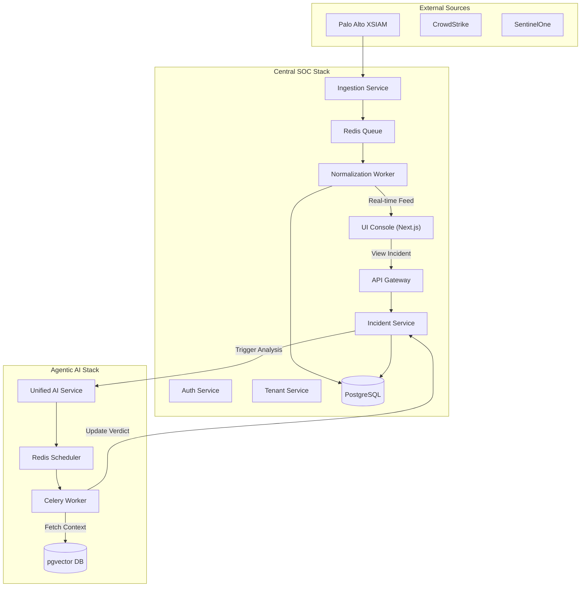
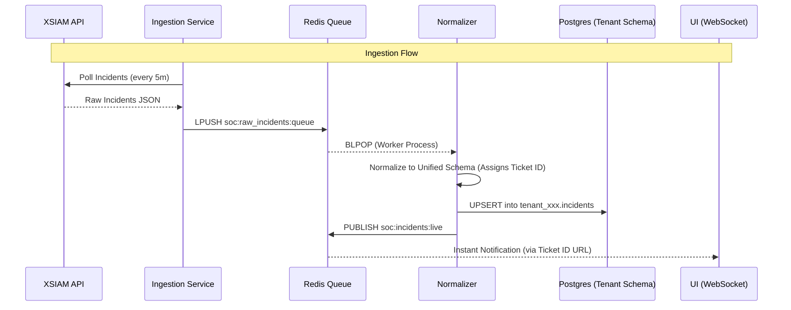

# System Infrastructure Documentation

This document provides a comprehensive technical overview of the **Agentic SOC Ecosystem**, covering its architecture, services, data flows, and infrastructure components.

---

## High-Level Architecture

The system follows a **multi-tenant microservices architecture** designed for high throughput incident ingestion and AI-driven automated analysis. It consists of two primary stacks: the **Central SOC** (Ingestion/Management) and the **Agentic AI** (Reasoning/Analysis).



---

## 1. Central SOC Services

### 핵심 서비스 (Core Services)

| Service Name | Technology | Responsibility |
| :--- | :--- | :--- |
| **UI Console** | Next.js, Tailwind CSS | High-performance dashboard with multi-customer views, real-time updates, and dark/light mode support. |
| **API Gateway** | FastAPI | Central entry point. Handles routing, authentication check, and rate limiting. |
| **Auth Service** | FastAPI, JWT | Manages users, sessions, and multi-tenant permissioning. |
| **Ingestion Service** | Python (APScheduler) | Periodically polls external XDR/EDR APIs (XSIAM, etc.) and enqueues raw data. |
| **Normalization Worker** | Python | Consumes raw incidents, transforms them into a unified schema, and persists them into **isolated tenant schemas**. |
| **Incident Service** | FastAPI, SQLAlchemy | Core API for querying incidents, managing status, and interfacing with the Agentic AI stack. |
| **Tenant Service** | FastAPI | Manages tenant lifecycle, schema provisioning, and connector configurations. |

### Infrastructure Components

*   **PostgreSQL (v16):** Uses a **Schema-per-Tenant** isolation model.
    *   `public` schema: Global configurations, tenants, and master incident index.
    *   `tenant_XXXX` schemas: Isolated tables for incidents, alerts, and configurations.
*   **Redis (v7):**
    *   Queueing: `soc:raw_incidents:queue` for asynchronous normalization.
    *   Pub/Sub: `soc:incidents:live` for real-time dashboard updates via WebSockets.

---

## 2. Agentic AI Stack

The Agentic AI stack provides the "brain" for autonomous security operations.

### Analysis Pipeline

1.  **Ingestion & Detection:** Raw incident data received via `/api/analyze`.
2.  **Task Scheduling:** Jobs are enqueued in Redis for Celery.
3.  **Knowledge Retrieval:** The `celery-worker` queries `pgvector` for past similar incidents and known patterns.
4.  **Autonomous Reasoning:** LLM-based agents execute multi-step analysis (XQL queries, log searches, causality chain building).
5.  **Verdict Generation:** A structured technical report (HTML/Markdown) is generated and saved back to the Central SOC.

---

## 3. Data Flow: Incident Lifecycle



### Routing & Identity
The system uses a **Dual-ID Routing** mechanism for incidents:
- **Internal UUID**: Used for database relations, primary keys, and foreign keys (e.g., comments, job mapping).
- **Human-Readable Ticket ID**: Used for user-facing URLs (`/incidents/ATPL-1234`) and cross-service communication (webhooks). The UI automatically redirects UUID-based URLs to their corresponding Ticket ID canonical paths.

---

## 4. Network Topology

The architecture uses a shared Docker network `soc-net` for cross-stack communication.

*   **Internal Network:** `soc-net` (Bridge) allows services to communicate via container names (e.g., `http://auth-service:8000`).
*   **External Access:**
    *   `8011`: UI Console (Frontend)
    *   `8012`: API Gateway (Backend)
    *   `8019`: DB Monitoring (pgAdmin)
    *   `9000`: Agentic AI API

---

## 5. Security Architecture

*   **Tenant Isolation:** Enforced via PostgreSQL schemas and Row Level Security (RLS) policies.
*   **Authentication:** JWT-based stateless auth. Tokens contain `tenant_id` claims to prevent cross-tenant data access.
*   **API Security:** The API Gateway validates all incoming tokens before routing requests to internal services.
*   **XSIAM Auth:** Uses HMAC-SHA256 signature with nonce and timestamp for secure external API communication.

---

## 6. Codebase Structure

```text
cental soc/
├── services/
│   ├── api-gateway/          # FastAPI entry point & routing
│   ├── auth-service/         # User auth & JWT management
│   ├── incident-service/     # Incident API & AI integration
│   ├── ingestion-service/    # External API polling (XSIAM, etc.)
│   ├── normalization-service/# Data transformation & persistence
│   ├── tenant-service/       # Multi-tenant management
│   └── ui-console/           # Next.js frontend application
├── shared/
│   ├── db/                   # Database init scripts & migrations
│   └── schema/               # Unified incident JSON schemas
├── scripts/                  # Utility scripts for maintenance/seeding
└── docker-compose.yml        # Orchestration for the SOC stack

Agentic AI/
├── api/                      # Analysis API endpoints
├── scheduler/                # Celery task definitions & XSIAM poller
├── database/                 # pgvector models & KB management
├── mcp-server/               # Model Context Protocol implementation
└── docker-compose.yml        # Orchestration for the AI stack
```
